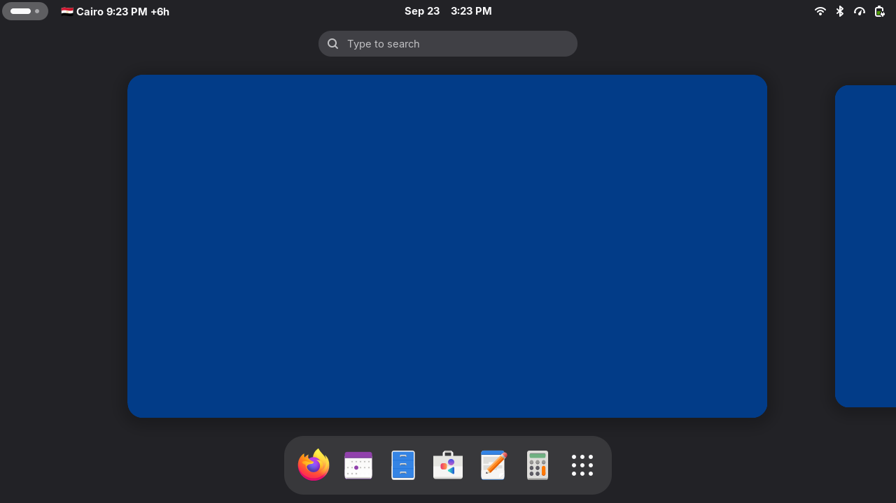
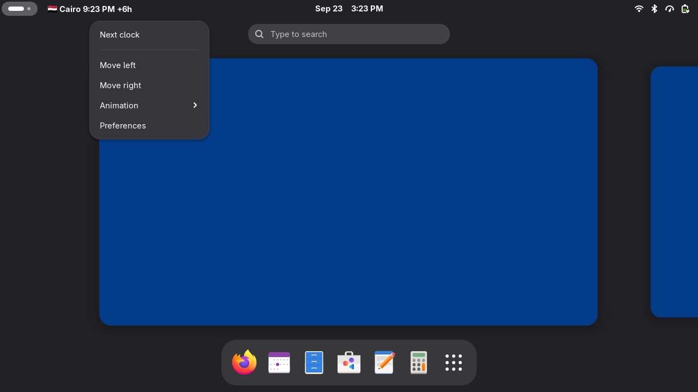

# Guigna — World Clocks Carousel

A GNOME Shell extension that shows your [GNOME Clocks](https://apps.gnome.org/Clocks/) world clocks in the top-left of the top bar as a carousel: country flag, local time and the difference to your time. Click or scroll to browse.

| Panel indicator | Click menu |
|---|---|
|  |  |

## Features

- Reads your existing world clocks from GNOME Clocks — no duplicate configuration
- Rotates automatically every 5 seconds (configurable transition: fade or slide)
- Country flag, city name, local time and offset from your timezone
- Scroll on the indicator to flip clocks manually
- Reposition the indicator anywhere in the top bar (menu or Preferences)

## Installation

### From extensions.gnome.org

_Review pending — link will be added once approved._

### From source

```sh
git clone https://github.com/enBonnet/guigna.git
cd guigna
glib-compile-schemas schemas/
gnome-extensions pack --force --out-dir=pack \
    --extra-source=constants.js --extra-source=LICENSE --extra-source=README.md
zip pack/*.zip schemas/gschemas.compiled   # the packer omits the compiled schema
gnome-extensions install --force pack/*.zip
```

Then log out and back in, and enable it:

```sh
gnome-extensions enable guigna@enbonnet.github.com
```

Requires GNOME Shell 50 or newer.

## Development

After editing the schema, recompile before packing:

```sh
glib-compile-schemas schemas/
```

Launch the preferences dialog standalone:

```sh
gnome-extensions prefs guigna@enbonnet.github.com
```

## License

[GPL-2.0-or-later](LICENSE) — see the [contributors page](https://github.com/enBonnet/guigna/graphs/contributors)
